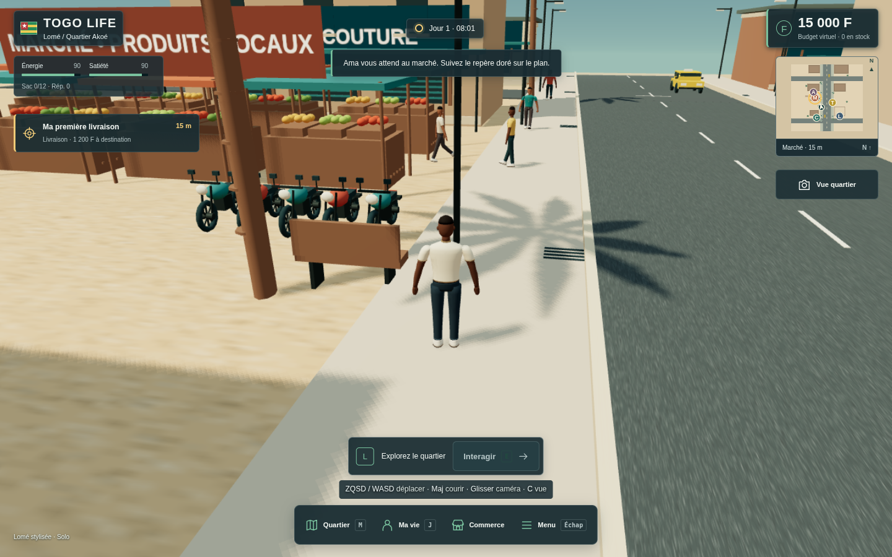
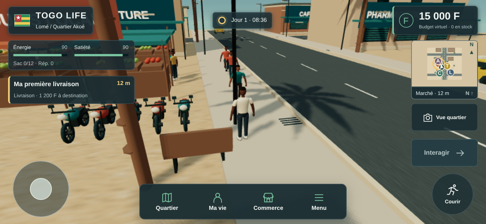

# Captures réelles — 10 octobre 2026

[Jouer à TOGO LIFE](https://togo-life-preview.vercel.app) · [Rapport complet](../INTERFACE_VALIDATION_REPORT.md)

Images natives sans retouche provenant des navigateurs Chromium des runs [CI9 gameplay](https://github.com/Louistatch/louis/actions/runs/38024690133) et [CI9 inspector original](https://github.com/Louistatch/louis/actions/runs/38024687518). Source `6740be8f053944bf027c4497c96786e13d0dc762`, même contenu SHA-256 que CI11 et le jeu public. Aucun visuel conceptuel ou image de Lagos Life/Townsmen utilisé comme capture TOGO LIFE.

## Monde en HTTPS

Capture native 1280×800 du probe HTTPS : avatar, marché, habitants, objectifs et interface. Rendu logiciel CI, pas screenshot provenant d’un ordinateur avec GPU matériel.

## Contrôles mobiles en paysage

Viewport 844×390 émulé, commandes réelles. Le dock contient les quatre labels et boutons ; joystick et course restent séparés. Aucun Android physique testé.

| Capture | Origine | Ce qu’elle montre |
|---|---|---|
| [Accueil et vrai avatar](2026-10-10/onboarding-inspector.png) | Inspector original du skill QA, HTTPS | Création/personnalisation et rendu glTF |
| [Jeu PC](2026-10-10/desktop-https.png) | Probe Chromium HTTPS | Quartier en activité |
| [Vue quartier](2026-10-10/overview-https.png) | Probe Chromium HTTPS | Cadrage élevé et repère VOUS |
| [Commerce](2026-10-10/commerce.png) | Parcours fonctionnel offline | État et commandes de gestion |
| [Portrait mobile](2026-10-10/mobile-portrait.png) | Probe tactile indépendant offline | Interface 390×844, joystick/course |
| [Paysage mobile](2026-10-10/mobile-landscape.png) | Probe tactile indépendant offline | Interface 844×390 après corrections |

[Vidéo WebM du flux réel CI11](../evidence/2026-10-10/actual-compositor-motion.webm) : 24 JPEG réels, VFR sans interpolation. Les états diagnostic et images présentées sont décalés ; elle ne prouve pas une animation professionnelle fluide. [Rapport brut](../evidence/2026-10-10/screencast-results.json).

[Empreintes SHA-256 et tailles](../evidence/2026-10-10/manifest.json) pour vérifier les fichiers. [Provenance et rapports bruts](../evidence/2026-10-10/README.md).
