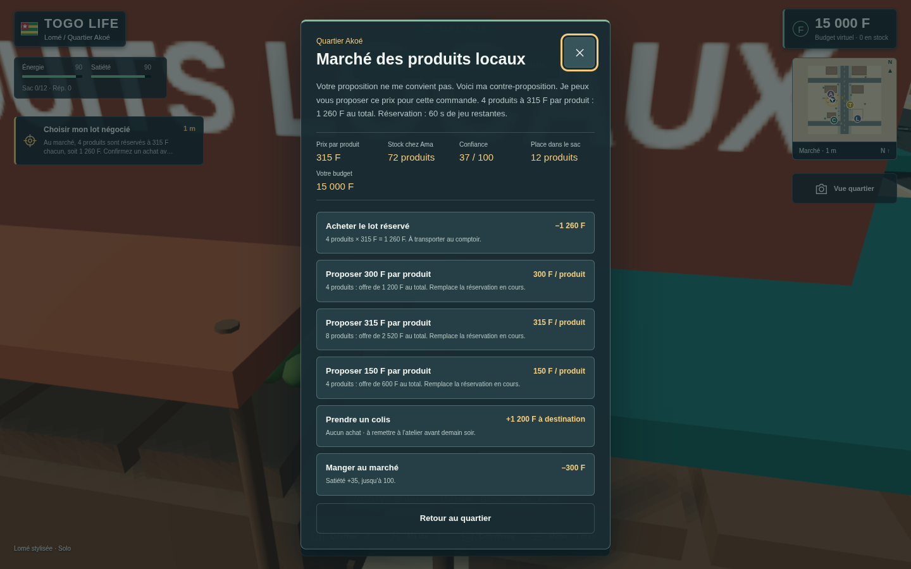
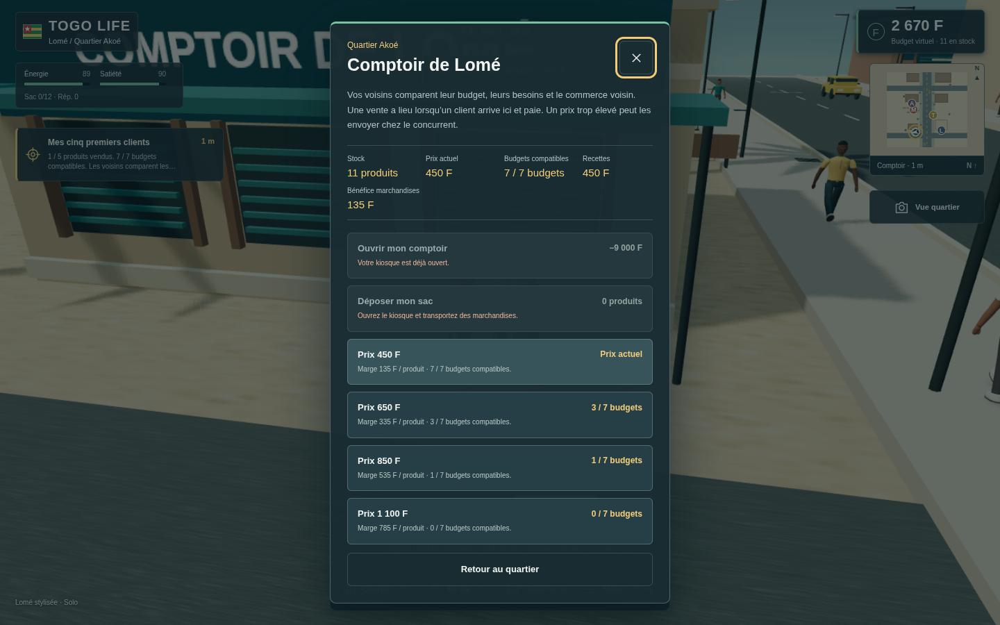
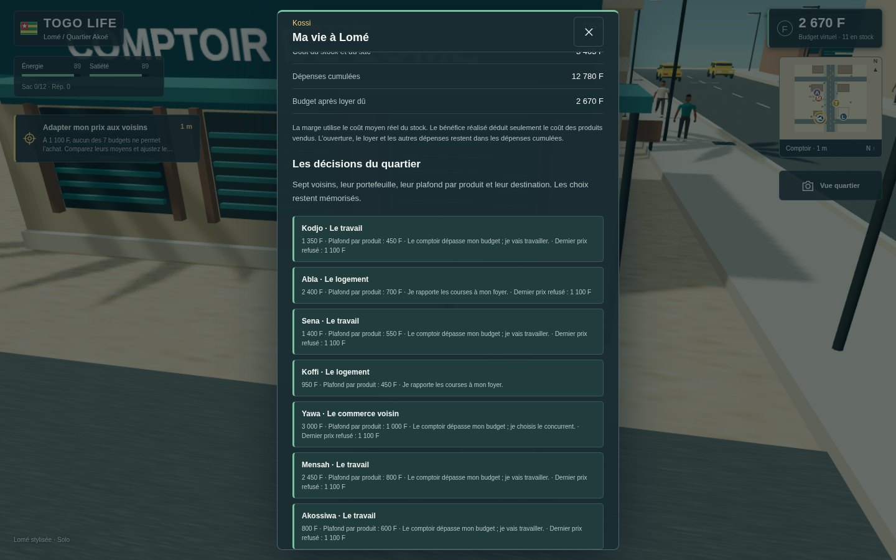
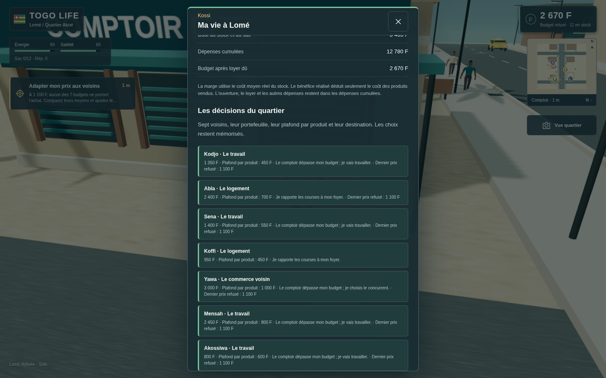
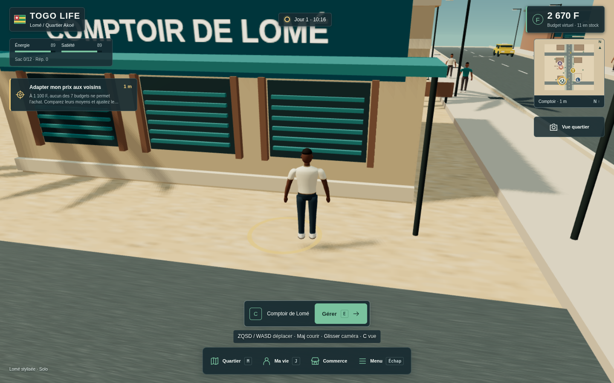
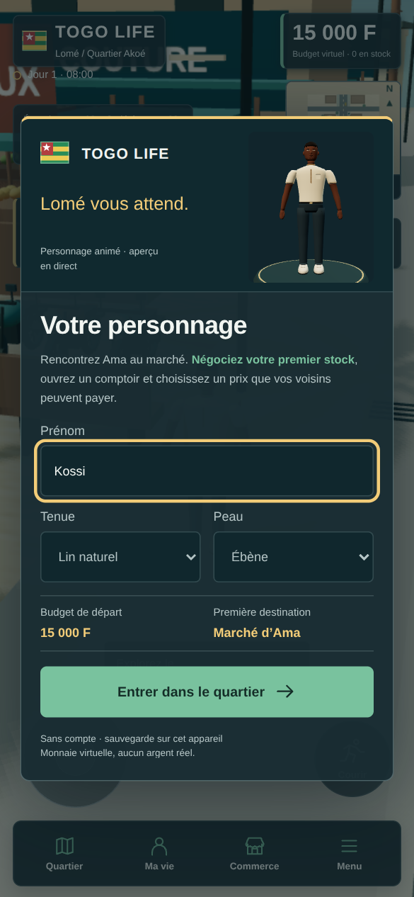
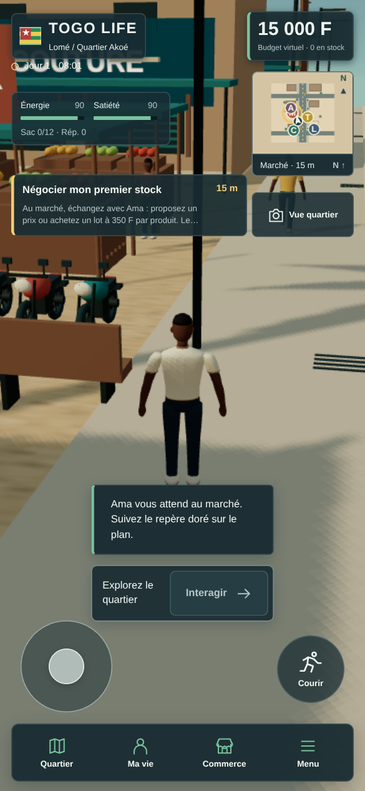
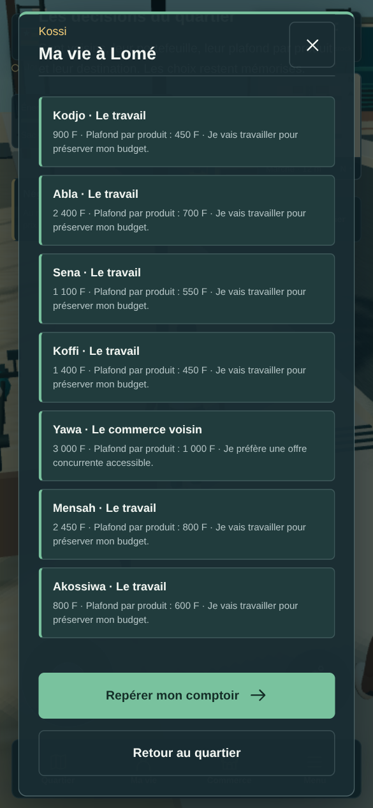
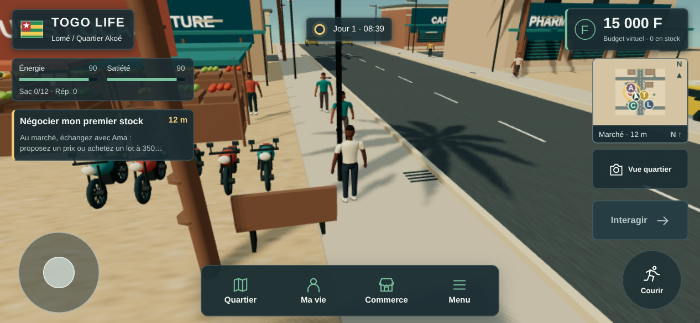

# TOGO LIFE — captures réelles du marché autonome

[Jouer](https://togo-life-preview.vercel.app) · [Run CI6](https://github.com/Louistatch/louis/actions/runs/38050314316) · [Provenance et hashes](manifest.json) · [Contrôle des images](../../evidence/autonomous-market/ci6-skills-execution.md)

Neuf captures Chromium du vrai jeu, source `39daf3befc4fdce95134c1c197d8e591fb412da8`. Les PNG originaux sont conservés sans retouche ; **aucune image conceptuelle**. Cliquez sur une image pour l'ouvrir à sa résolution native.

Les cinq vues PC proviennent du véritable aperçu HTTPS en `1440×900`. Les vues mobiles sont des émulations : portrait CSS `390×844`, paysage `844×390`, facteur de pixels de 1,5. **Aucun appareil Android physique testé.** Le rendu logiciel SwiftShader ne valide pas les objectifs matériels de 30/60 FPS ; le quartier de Lomé reste stylisé.

## PC — scénario HTTPS

| Capture | Observation |
| --- | --- |
|  | Ama propose quatre produits à **315 F**, soit **1 260 F**, avec réservation limitée. |
|  | Vente à **450 F**, stock restant **11**, bénéfice marchandises **135 F**. |
|  | Portefeuilles, plafonds par produit, souvenirs du refus à **1 100 F** et choix du commerce concurrent. |
|  | Les décisions individuelles et leurs conséquences restent visibles après rechargement. |
|  | Vue du quartier actif, avatar, comptoir, habitants et contrôles. |

## Mobile — portrait et paysage émulés

| Capture | Observation |
| --- | --- |
|  | Aperçu 3D, choix du personnage et entrée dans le quartier. PNG **585×1266**. |
|  | Joystick, course, objectif, carte et dock en portrait. PNG **585×1266**. |
|  | Sept cartes après défilement ; fermeture et actions inférieures visibles. PNG **585×1266**. |
|  | Contrôles séparés et personnage visible en paysage. PNG **1266×585**. |

Les rapports CI6 attestent de **39 vérifications régression, 25 tactiles et deux parcours autonomes de 70 vérifications réussis**, offline et HTTPS. Les images fixes complètent ces preuves ; elles ne suffisent pas à juger une animation professionnelle.
